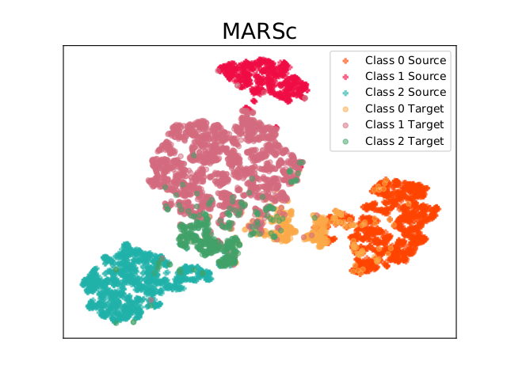
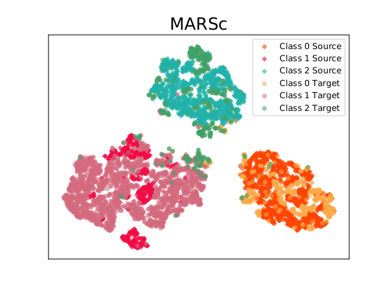

### Optimal Transport for Class-Conditional and Target Shift

This is a Pytorch implementation of the paper Optimal Transport for Class-Conditional and Target Shift  

### Requirements
* python3.8
* pytorch 1.3
* torchvision
* numpy
* tqdm
* POT
* sklearn

### The organisation of the files are 

* ClassDANN.py ClassWDGRL.py ClassWDTS_Adv.py

  	provide respectively implementations of a DANN, a 
  	weighted Wasserstein distance based approach as defined in Wu 2019 and our 
  	approach.
  
* compare_toy_one_iter.py  compare_toy_setting.py 
     	allows to run one iteration of those algorithms on the
    	toy problem defined in the setting file. It executes
	one run of DANN, a W_beta=1, and MARSg. 
	(takes few minutes on a core I7 laptop)

* compare_visda_one_iter.py 
	run the Source only, WD based DA, and our approach on a VisDA
	problem. Default dataset setting works on a 3-class problem. We use a subpart of the original 12-class problem

* compare_visda_setting.py compare_visda_models.py 
	define the dataset and their imbalance and the network models used.

* utils_local.py 
	contains some utility functions

* visda_shift.py 
	defines our dataset loader function. It needs the downloading of
	the pre-computed data features available at 
	https://figshare.com/articles/visda-train0411_npz/11865915

## Some latent features obtained on the VisDA 3-class problem using agglomerative clustering
##### after training on the source domain only
 
##### after adaptation 
 
 
